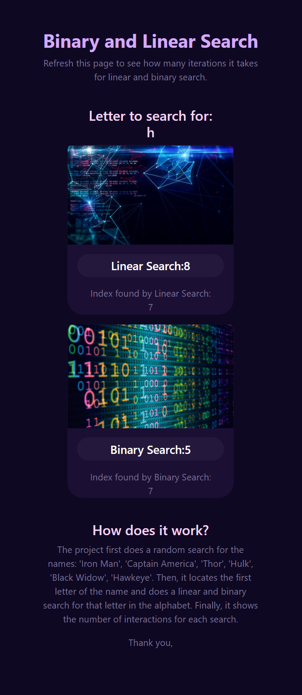

<div align="center" id="top"> 
  
&#xa0;

<a href="https://giankbo.github.io/binary-search/" target="blank">Demo</a>

</div>

<h1 align="center">Binary Search</h1>

<p align="center">
  

  

  

  
</p>

<p align="center" markdown="1">
  In this MIT xPRO JavaScript project, we'll complete a binary search partially defined in the recursiveBinarySearch function in order to compare the iterations between "Binary Search vs. Linear Search" on an array containing the letters of the alphabet. 
</p>

<p align="center">
   <a href="#writing_hand-features">Features</a>
   ·
   <a href="#checkered_flag-how-to-run">How to run</a>
   ·
   <a href="#handshake-credits">Credits</a>
   ·
   <a href="#memo-license">License</a>
   ·
   <a href="https://github.com/giankbo" target="blank">Author</a>
</p>

<br>

## :writing_hand: Features

- Splits the data set with each iteration by calculating the mid-point,
- Checks whether the mid-point is what you are searching for or not,
- Checks which half of the split data contains the target,
- Uses that part of the data and starts the search again.

## :checkered_flag: How to run

Before starting, you need to have [Git](https://git-scm.com) and [Visual Studio Code](https://code.visualstudio.com/) installed. Then, clone the repo:

```bash
# Clone this project
$ git clone https://github.com/giankbo/binary-search
# Access
$ cd binary-search
```

## :handshake: Credits

<a href="https://xpro.mit.edu/" target="blank">MIT xPRO</a>

## :memo: License

This project is under license from MIT. For more details, see the [LICENSE](LICENSE.md) file.

&#xa0;

<a href="#top">Back to top</a>
